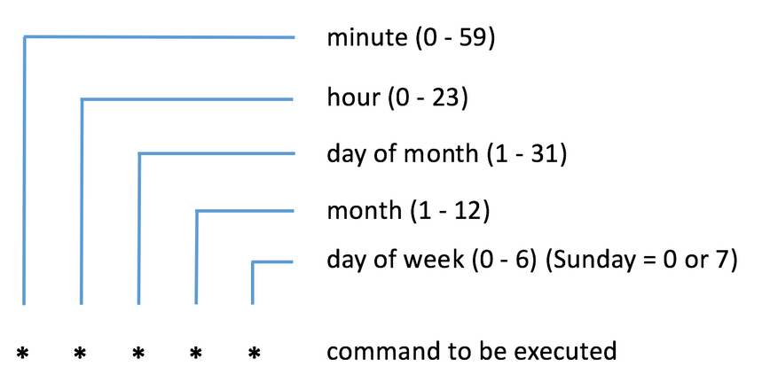
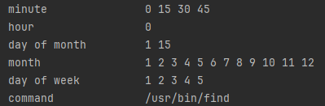

# Contab format definition

# Run from console
Build JDK 15+, gradle:

Bash:
./gradlew build

Windows:
gradlew.bat build

Run example:
`java -jar build/libs/ts-crontab-1.0-SNAPSHOT.jar "*/15 0 1,15 * 1-5 /usr/bin/find"`

Output:

# Unit tests classes:
- CrontabUnitTests
- CrontabIntegralTests

# Tests run
Bash:
`./gradlew test`

Windows
`gradlew.bat test`